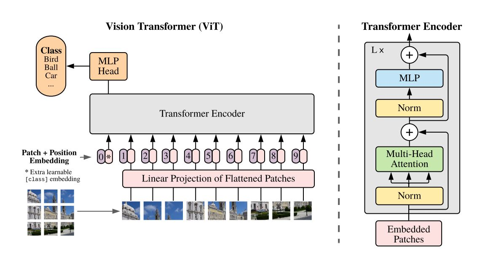
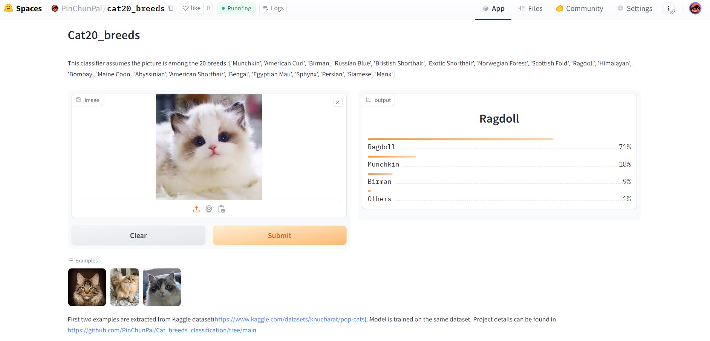
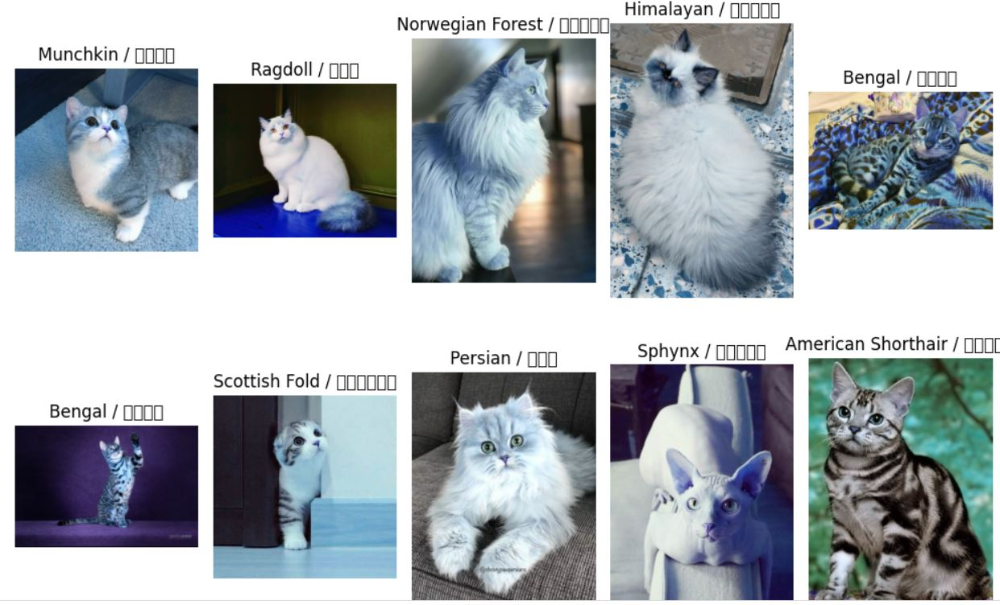
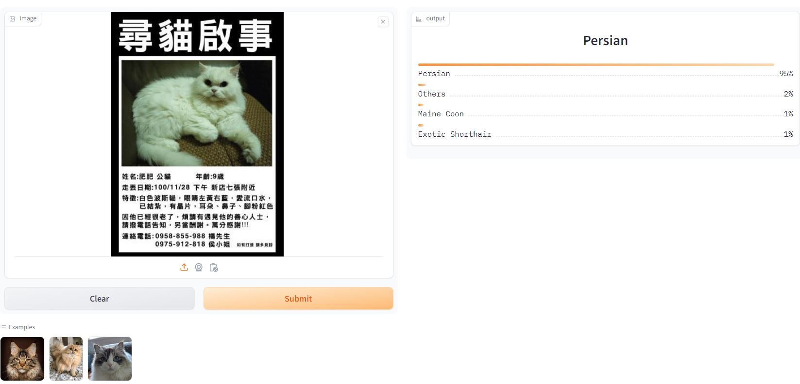

# **Cat Breeds Classification with Vision Transformer**

## Abstract

This project represents an end-to-end side project in the realm of computer vision, employing a dataset sourced from [Kaggle](https://www.kaggle.com/datasets/knucharat/pop-cats). It's worth noting that the resource can be traced back to [Petfinder](https://www.petfinder.com/developers/), accessible through the [petpy](https://github.com/aschleg/petpy) library. The dataset used in this endeavor has undergone thorough cleaning, and the ensuing integration involves storing path-label pairs in `labels.csv`.

The core of the project revolves around the utilization of the [vision transformer (VIT)](https://huggingface.co/google/vit-base-patch16-224), a pre-trained model released by Google. The model is fine-tuned to develop a classifier for 20 common cat breeds. The Google VIT comes pre-trained to classify 1000 classes of objects, encompassing 5 cat breeds. Importantly, three of these 5 breeds (Persian, Egyptian Mau, Siamese) align with our target 20 breeds. This setup presents a unique opportunity to explore fine-tuning a larger model to address a more specific task, offering valuable insights.

    The architecture overview of Vision Transformer. This diagram is extracted from
    https://arxiv.org/abs/2010.11929

## Result
In order to establish a basic standard, I randomly selected 15 images from the three existing breeds in VIT targets (Persian, Egyptian Mau, Siamese) to test the vanilla code before fine-tuning. The accuracy at this initial stage was 66.7% (refer to `Cat_breeds_basic.ipynb` in colab folder for detailed information). After undergoing 260 epochs of fine-tuning, the model converged to an impressive accuracy of 92.6% on the test dataset. Subsequently, I conducted an additional training run on the entire dataset for 15 more epochs. Further details can be found in the colab folder.

The ultimate outcome of this project is shared on [HuggingFace](https://huggingface.co/PinChunPai/cat20_breed_fine_tune) and subsequently employed in constructing a [website application](https://huggingface.co/spaces/PinChunPai/cat20_breeds). This platform enables the public to assess the model's performance by uploading their own cat pictures, bringing the evaluation process into the real world and fostering broader engagement.

    Demonstration of website application.

## Dataset
The images used for fine tuning model is obtained from [Kaggle](https://www.kaggle.com/datasets/knucharat/pop-cats). It contains 20 common breeds of cat, each containing 500 jpg images.
1. Abyssinian
2. American Curl
3. American Shorthair
4. Bengal
5. Birman
6. Bombay
7. British Shorthair
8. Egyptian Mau
9. Exotic Shorthair
10. Himalayan
11. Maine Coon
12. Manx
13. Munchkin
14. Norwegian Forest
15. Persian
16. Ragdoll
17. Russian Blue
18. Scottish Fold
19. Siamese
20. Sphynx

    Samples of dataset. I add corresponding Mandarin name for each breed but it does not display appropriately.

## Approach

Fine-tuning a model can be achieved through various approaches, each with its unique advantages and considerations:

1. **Replace Model's Last Layer:**
   - This involves substituting the model's last layer, specifically the id2label and label2id maps, with customized maps. The model is then retrained. While this approach may be time-consuming, it is expected to yield optimal results.

2. **Transfer Learning with Additional Neural Network:**
   - Remove the last layer and fix the pre-trained model. Utilize the output of this model as the input for a smaller, additional neural network (NN). This approach is more efficient, especially when the pre-trained model has already learned crucial features from ImageNet.

3. **Fine-tuning Selected Layers:**
   - Retain most parameters of the pre-trained model and train some of its last layers alongside our customized NN. This middle-ground choice balances the trade-off between model training cost and the enhancement of model capabilities.

For this project, I opted for the first approach to gain insights into the training cost associated with larger models like VIT. However, considering the effective feature learning observed in the testing stage, the other two approaches might be more reasonable choices for future experiments.

The project ran on Colab with a V100 GPU. Due to environment limitations, the batch size was set to 64, and `num_workers` was set to zero. Each epoch took approximately 4 minutes.

## Testing and Future Direction
In order to assess the model's performance, I conducted testing using cat pictures sourced from various Mandarin websites through online searches. The objective was to avoid sampling pictures already present in the training dataset. Additionally, I specifically chose non-JPG files when available. Out of 20 testing instances, the model yielded 18 correct results. All results are stored in TEST folder.

As part of future directions, there is an opportunity to further expand and refine the testing process. Consider exploring a broader variety of images and potentially incorporating more diverse datasets to enhance the model's robustness. Additionally, continuous evaluation and refinement of the model's performance with real-world data will contribute to its ongoing improvement.

    An example of testing. The picture is extracted from Mandarin website.

